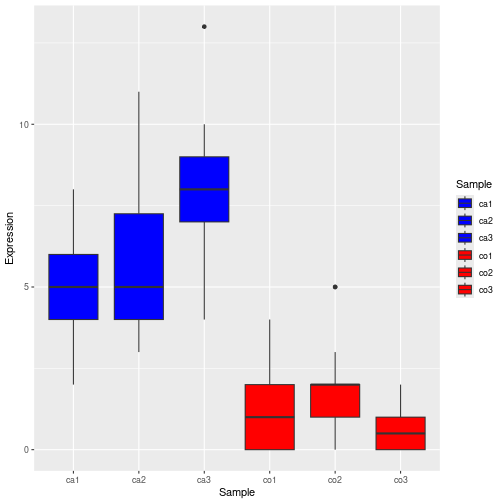

#### 0 - import libraries


#### 1 - Assume the cells have 20 genes.


``` r
num_genes <- 20
```

#### 2 - Use a Poisson distribution with means = 5, 6, 7 to generate 3 gene expression datasets representing treated


``` r
treated5 <- rpois(num_genes, lambda = 5)
treated6 <- rpois(num_genes, lambda = 6)
treated7 <- rpois(num_genes, lambda = 7)
```

#### 3 - Repeat the above with means = 1, 2, 1 to generate 3 gene expression datasets representing untreated.


``` r
untreat1 <- rpois(num_genes, lambda = 1)
untreat2 <- rpois(num_genes, lambda = 2)
untreat3 <- rpois(num_genes, lambda = 1)
```

#### 4 - Generate a data frame whose rows are genes (20 total) and whose columns are samples (ca1, ca2, ca3 representing cases and co1, co2, co3, representing controls)


``` r
data <- data.frame(
  Gene = paste("Gene", 1:num_genes, sep=""),
  ca1 = treated5,
  ca2 = treated6,
  ca3 = treated7,
  co1 = untreat1,
  co2 = untreat2,
  co3 = untreat3
)
print(data)
```

```
     Gene ca1 ca2 ca3 co1 co2 co3
1   Gene1   5  11   8   2   2   1
2   Gene2   6   7   9   0   5   0
3   Gene3   5   9   4   0   1   1
4   Gene4   4   7   9   2   1   1
5   Gene5   6   4  10   1   2   1
6   Gene6   8   9   7   0   0   2
7   Gene7   2   5   7   1   1   1
8   Gene8   5   7   7   1   2   2
9   Gene9   5  10  10   1   3   0
10 Gene10   4   5  13   4   2   0
11 Gene11   2   7   8   0   5   1
12 Gene12   5   3   8   2   2   0
13 Gene13   4   8   7   1   1   0
14 Gene14   5   5   6   0   1   0
15 Gene15   8   3   8   0   2   0
16 Gene16   6   3   8   0   2   1
17 Gene17   2   5   9   3   2   2
18 Gene18   6   3   7   2   0   0
19 Gene19   5   4  10   2   2   0
20 Gene20   4   4   9   1   2   0
```

#### 5 - Turn the data farme into long format


``` r
gene_expression <- data %>% pivot_longer(
    cols = -Gene, 
    names_to = "Sample", 
    values_to = "Expression"
)
print(gene_expression)
```

```
# A tibble: 120 × 3
   Gene  Sample Expression
   <chr> <chr>       <int>
 1 Gene1 ca1             5
 2 Gene1 ca2            11
 3 Gene1 ca3             8
 4 Gene1 co1             2
 5 Gene1 co2             2
 6 Gene1 co3             1
 7 Gene2 ca1             6
 8 Gene2 ca2             7
 9 Gene2 ca3             9
10 Gene2 co1             0
# ℹ 110 more rows
```

#### 6 - Use ggplot to plot the boxplots for each.


``` r
ggplot(
  gene_expression, 
  aes(
    x = Sample,
    y = Expression,
    fill = Sample
  )
) + (
  geom_boxplot()
) + (
# 7 - try to color-code the box-plots by sample type 
# (blue representing case and red representing control). 
  scale_fill_manual(
    values = c(  # 
      "ca1" = "blue", "ca2" = "blue", "ca3" = "blue", 
      "co1" = "red", "co2" = "red", "co3" = "red"
    )
  )
)
```


